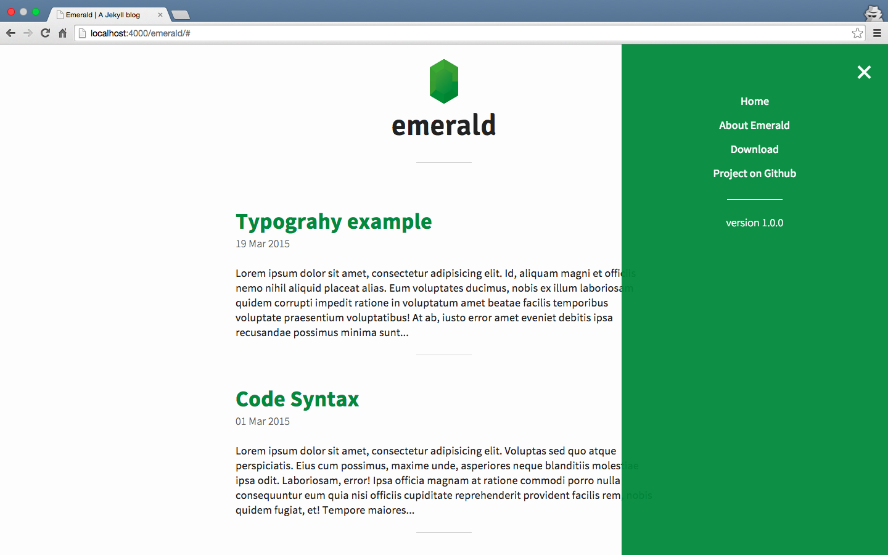

## Abouttt
Emerald is a minimal theme created for Jekyll. The main purpose of Emerald is to provide a clear theme for those who want a blog ready to use, focused on the content and mobile-first.

For further details on Emerald, please visit the [repository on Github](https://github.com/KingFelix/emerald/).

### Setup
Emerald may be installed by simply downloading the .zip folder from the [repository on Github](https://github.com/KingFelix/emerald/archive/master.zip).

After extracting the content from the folder into the selected directory, you can type ``jekyll serve`` from the terminal, than open your browser to ``0.0.0.0:4000/emerald/`` and you will find it there.

Additionally it is possible to fork the repository and use Github Pages as hosting. By following this way it will be enough to change the ``baseurl`` value into the ``_config.yml`` file, with the directory name of your project (for example /blog) or simply with a "/" (slash) if you want install Emerald in the root. 

Last but not least: the [Jekyll documentation](http://jekyllrb.com) is the best starting point!

Enjoy!

<a href="https://twitter.com/deathbullet" class="twitter-follow-button" data-show-count="false">Follow @deathbullet</a>

        

        
        <noscript>Please enable JavaScript to view the <a href="http://disqus.com/?ref_noscript">comments powered by Disqus.</a></noscript>
        <a href="http://disqus.com" class="dsq-brlink">comments powered by Disqus</a>
    
